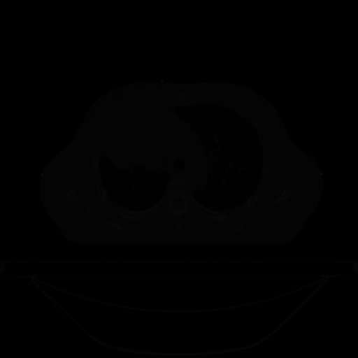

# Exemples de traitement d'images

Carnets Jupyter en support au cours de traitement d'image dans le cadre des cours [PHY-4000](https://www.ulaval.ca/les-etudes/cours/repertoire/detailsCours/phy-4000-imagerie-medicale.html) (1er cycle), PHY-7094 (2e-3e cycle) et PHY-7999 (3e cycle) donné à l'Université Laval à la session d'automne 2019

Tout ces exemples utilisent l'image suivante pour tester différentes opérations de traitement d'image:

- Les manipulations spatiales, manipulations d'intensités et les filtres par noyaux ce trouvent dans ce [premier carnet](image_manip.ipynb)
- Les manipulations dans l'espace de Fourier se trouvent dans ce [deuxième carnet](espace_Fourier.ipynb)
- Les exemples de contours et de segmentation se trouvent dans ce [troisième carnet](contours.ipynb)